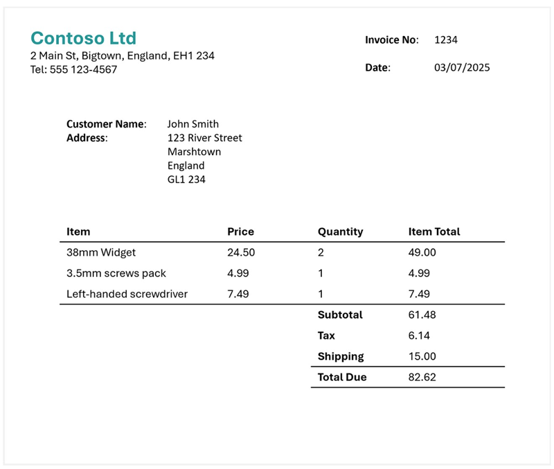
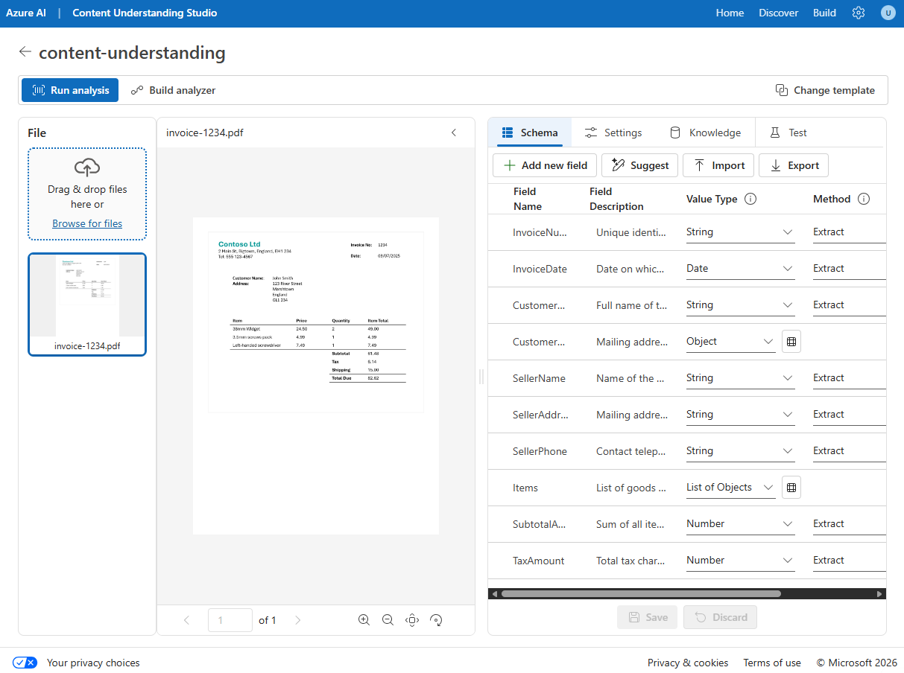
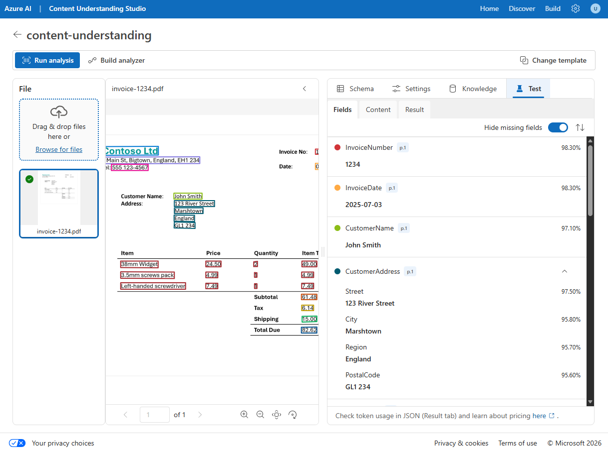
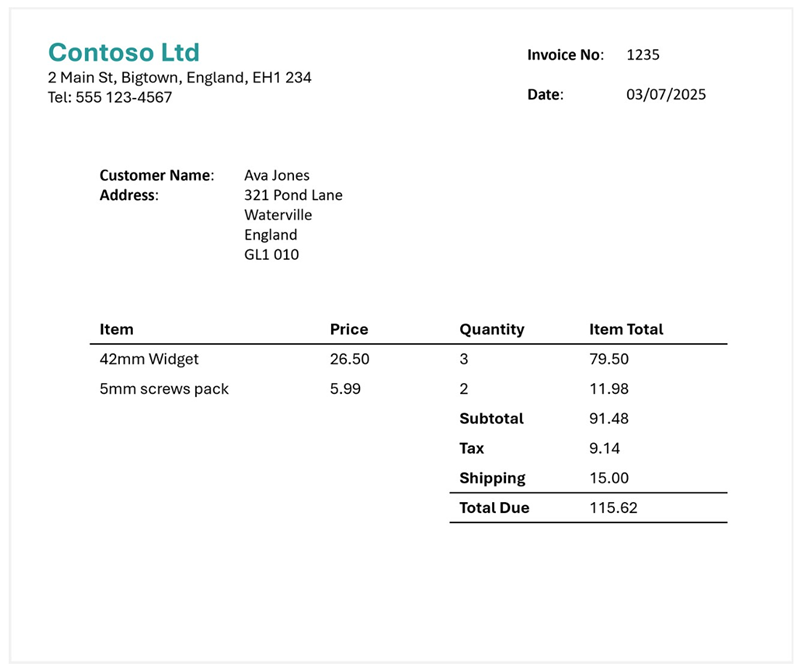
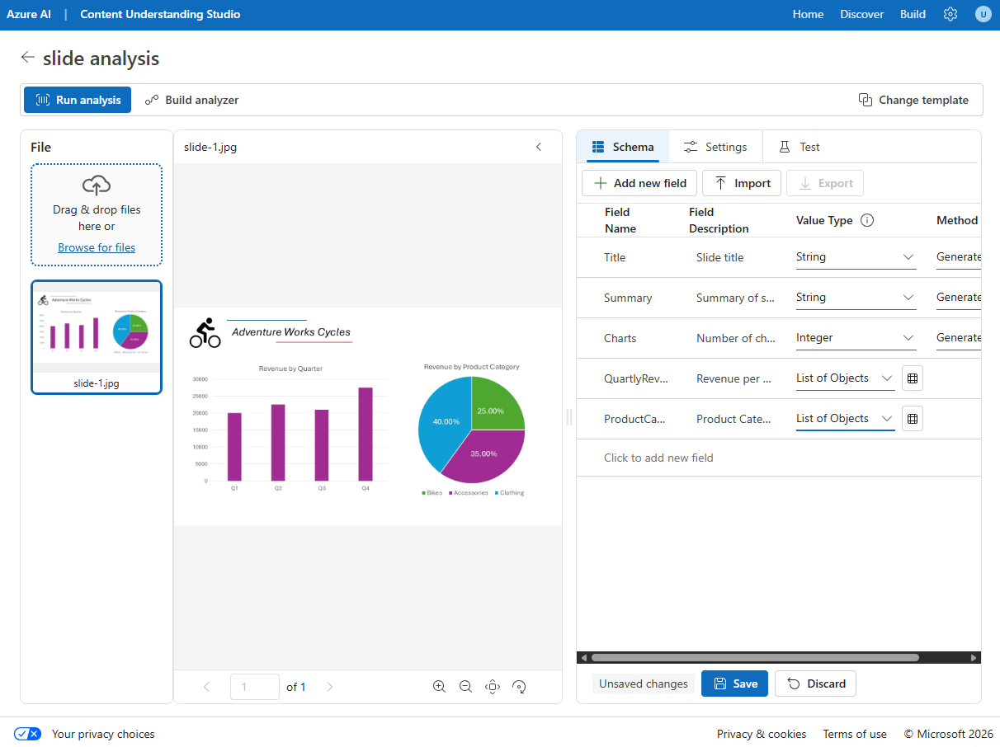
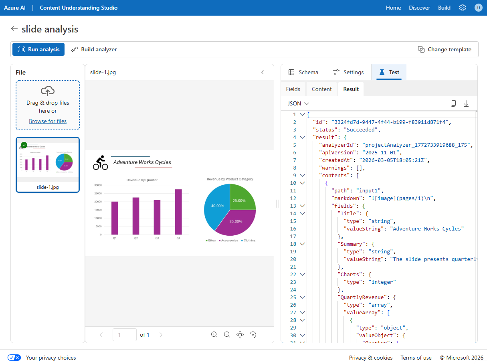

---
lab:
  title: Extract information from multimodal content
  description: Use Azure Content Understanding to extract insights from documents, images, audio recordings, and videos.
  duration: 40
  level: 200
  islab: true
  status: 'released'
  primarytopics:
    - Azure
    - Azure Content Understanding
---

# Extract information from multimodal content

In this exercise, you use Azure Content Understanding to extract information from a variety of content types; including an invoice, an image of a slide containing charts, an audio recording of a voice message, and a video recording of a conference call.

This exercise takes approximately **40** minutes.

## Create a Microsoft Foundry resource and project

The features we're going to use in this exercise require a Microsoft Foundry resource and project.

1. In a web browser, open the [Microsoft Foundry portal](https://ai.azure.com) at `https://ai.azure.com` and sign in using your Azure credentials. Close any tips or quick start panes that are opened the first time you sign in.
1. Make sure the **New Foundry** toggle is on so that you're using **Foundry (new)**.
1. If you aren't prompted to create a new project automatically, select the project name in the upper-left corner, and then select **Create new project**.
1. Give your project a name and expand **Advanced options** to specify the following settings:
    - **Project name**: *Provide a valid name for your project*
    - **Foundry resource**: *Use the default*
    - **Region**: Choose one of the following supported regions:\*
        - Australia East
        - East US
        - East US 2
        - Japan East
        - North Europe
        - South Central US
        - Southeast Asia
        - Sweden Central
        - UK South
        - West Europe
        - West US
        - West US 3
    - **Subscription**: *Your Azure subscription*
    - **Resource group**: *Create or select a resource group*
    

    > \*Azure Content Understanding is available in selected regions. See the [region support documentation](https://learn.microsoft.com/azure/ai-services/content-understanding/language-region-support) for the latest availability.

1. Select **Create** and wait for your project to be created.

## Download content

The content you're going to analyze is in a .zip archive. Download it and extract it in a local folder.

1. In a new browser tab, download [content.zip](https://github.com/microsoftlearning/mslearn-ai-information-extraction/raw/main/Labfiles/content/content.zip) from `https://github.com/microsoftlearning/mslearn-ai-information-extraction/raw/main/Labfiles/content/content.zip` and save it in a local folder.
1. Extract the downloaded *content.zip* file and view the files it contains. You'll use these files to explore Content Understanding analyzers in this exercise.

> **Note**: If you're only interested in exploring analysis of a specific modality (documents, images, video, or audio), you can skip to the relevant task below. For the best experience, go through each task to learn how to extract information from different types of content.

## Try prebuilt analyzers in Microsoft Foundry

Azure Content Understanding includes prebuilt **Read** and **Layout** analyzers that can extract text and structural elements from documents without requiring any custom configuration. These prebuilt analyzers are available directly in the Foundry (new) portal as AI Services models.

### Use the Layout analyzer in the playground

1. In the [Microsoft Foundry portal](https://ai.azure.com), make sure the **New Foundry** toggle is on.
1. Select **Build** in the upper-right menu, then select **Deployments** in the left pane.
1. Select the **AI Services** tab to view the prebuilt models provided by Foundry Tools.
1. Find and select **Azure Content Understanding - Layout**.

    This opens the Layout analyzer playground page, where you can test the layout model on sample data or your own files.

1. In the playground, use the option to upload your own data and upload the **invoice-1234.pdf** file from the folder where you extracted content files. This file contains the following invoice:

    

1. Run the analyzer and wait for analysis to complete.
1. Review the results. You can view the extracted content either as formatted output or as raw JSON data. Notice that the Layout analyzer extracts text, tables, and structural elements such as paragraphs and sections from the document.

    > **Note**: The prebuilt **Read** and **Layout** analyzers extract content from documents without requiring a generative AI model. **Read** extracts text elements (words, paragraphs, formulas, and barcodes), while **Layout** additionally extracts tables, figures, document structure, hyperlinks, and annotations. These analyzers are useful for general-purpose content extraction, but they don't extract specific custom fields such as invoice amounts or vendor names.

1. Optionally, go back to the **AI Services** tab and try **Azure Content Understanding - Read** with the same file to compare the results. Notice that Read extracts text without layout analysis.

## Set up Content Understanding Studio for custom analyzers

To extract specific fields from your content (such as invoice amounts, caller names, or meeting participants), you need to build custom analyzers. Custom analyzers are created in **Content Understanding Studio**, a separate web-based tool for building and testing analyzers with custom schemas.

1. In a new browser tab, open [Content Understanding Studio](https://contentunderstanding.ai.azure.com) at `https://contentunderstanding.ai.azure.com`.
1. If prompted, sign in with the same Azure credentials you used for the Foundry portal.
1. On the **Settings** page (or if redirected to set up your resource), select the **+ Add resource** button.
1. Select the Foundry resource you created earlier, and select **Next** > **Save**.

    > **Tip**: Make sure that the **Enable autodeployment for required models if no defaults are available** checkbox is selected. This ensures your resource is set up with the required `GPT-4.1`, `GPT-4.1-mini`, and `text-embedding-3-large` models that custom analyzers need.

1. After your resource is connected, you're ready to create custom analyzers. Select **Content Understanding** in the top navigation to go to the home page.

## Extract information from invoice documents

You are going to build a custom Azure Content Understanding analyzer that can extract specific fields from invoices. You'll create a project in Content Understanding Studio, define a schema based on a sample invoice, and then build a reusable analyzer.

### Create a storage account

Content Understanding Studio requires an Azure Blob Storage account to store the data used for building custom analyzers. You need to create one in the same resource group as your Foundry resource.

1. In a new browser tab, open the [Azure portal](https://portal.azure.com) at `https://portal.azure.com` and sign in with your Azure credentials.
1. Select **+ Create a resource**, search for `Storage account`, and create a new **Storage account** resource with the following settings:
    - **Subscription**: *Your Azure subscription*
    - **Resource group**: *The same resource group as your Foundry resource*
    - **Storage account name**: *Enter a globally unique name*
    - **Region**: *The same region as your Foundry resource*
    - **Preferred storage type**: Azure Blob Storage or Azure Data Lake Storage Gen 2
    - **Performance**: Standard
    - **Redundancy**: Locally-redundant storage (LRS)
1. Select **Review + create**, and then **Create**. Wait for deployment to complete.

### Define a schema for invoice analysis

1. In Content Understanding Studio, select the **Get started** button in the custom projects section, and select **Create**.
1. Select **Extract content and fields with a custom schema**, then create a project with the following settings:
    - **Project name**: `Invoice analysis`
    - **Description**: `Extract data from an invoice`
    - **Advanced settings**
        - **Connected resource**: *Confirm your Foundry resource is selected*
        - **Connect storage account**: *Select the storage account you just created*
        - **Blob container**: *Create a new container named* `content-understanding`
1. Wait for the project to be created.

    > **Tip**: If an error accessing storage occurs, wait a minute and try again. Permissions for a new resource may take a few minutes to propagate.

1. Upload the **invoice-1234.pdf** file from the folder where you extracted content files.

    Content Understanding classifies your data and recommends analyzer templates based on the uploaded content.

1. In the **Choose a template** window, select the **Invoice** template and select **Save**.

    The *Invoice* template includes common fields that are found in invoices. You can use the schema editor to delete any of the suggested fields that you don't need, and add any custom fields that you do.

1. In the list of suggested fields, select **BillingAddress**. This field is not needed for the invoice format you have uploaded, so use the **Delete field** (**&#128465;**) icon that appears at the end in the selected field row to delete it.
1. In the top bar of the schema tab, select **Suggest**. This will look at the sample invoice and suggest which fields should be a part of your schema. Expand the **Items** field to see which subfields are suggested. Adding those fields will replace your existing schema, so be careful in your projects if you've edited a schema. Select **Save**.
1. Use **+ Add new field** button to add the following field, selecting **Save** (**&#10003;**) for each new field:

    | Field name | Field description | Value type | Method |
    |--|--|--|--|
    | `TotalQuantity` | `Total number of items on the invoice` | String | Auto |

1. Verify that your completed schema looks like this, and select **Save**.

    

1. Select the **Test** tab, then select **Run analysis** to test your schema. Wait for analysis to complete.

1. Review the analysis results, which should look similar to this:

    

1. View the details of the fields that were identified in the **Fields** pane.

### Build and test an analyzer for invoices

Now that you have defined a schema to extract fields from invoices, you can build an analyzer to use with similar documents.

1. Select the **Build analyzer** button at the top, and build a new analyzer with the following properties (typed exactly as shown here):
    - **Name**: `invoiceanalyzer`
    - **Description**: `Invoice analyzer`
1. When the analyzer has been built, select **Jump to analyzer list** to view all built analyzers, then select the **invoiceanalyzer** link. The fields defined in the analyzer's schema will be displayed.
1. In the **invoiceanalyzer** page, select the **Test** tab.
1. Upload **invoice-1235.pdf** from the folder where you extracted the content files, and run the analysis to extract field data from the invoice.

    The invoice being analyzed looks like this:

    

1. Review the **Fields** pane, and verify that the analyzer extracted the correct fields from the test invoice.
1. Review the **Results** pane to see the JSON response that the analyzer would return to a client application.
1. Close the **invoiceanalyzer** page to return to the analyzer list.

## Extract information from a slide image

You are going to build a custom Azure Content Understanding analyzer that can extract information from a slide containing charts.

### Define a schema for image analysis

1. In **Project list** tab, select **Create** and select **Extract content and fields with a custom schema**, then create a project with the following settings:
    - **Project name**: `Slide analysis`
    - **Description**: `Extract data from an image of a slide`
    - **Advanced settings**: *Verify the settings are the same as the last project*
1. Wait for the project to be created.

1. Upload the **slide-1.jpg** file from the folder where you extracted content files. Then select the **Image analysis** template and select **Save**.

    The *Image analysis* template doesn't include any predefined fields. You must define fields to describe the information you want to extract.

1. Use the **+ Add new field** button to add the following fields, selecting **Save changes** (**&#10003;**) for each new field:

    | Field name | Field description | Value type | Method |
    |--|--|--|--|
    | `Title` | `Slide title` | String | Generate |
    | `Summary` | `Summary of the slide` | String | Generate |
    | `Charts` | `Number of charts on the slide` | Integer | Generate |

1. Use **+ Add new field** button to add a new field named `QuarterlyRevenue` with the description `Revenue per quarter` with the value type **List of objects**. Then, select the table icon next to the value type dropdown. In the new page for the table subfields that opens, add the following subfields:

    | Field name | Field description | Value type | Method |
    |--|--|--|--|
    | `Quarter` | `Which quarter?` | String | Generate |
    | `Revenue` | `Revenue for the quarter` | Number | Generate |

1. Select **Back** to return to the top level of your schema, and use **+ Add new field** button to add a new field named `ProductCategories` with the description `Product categories` with the value type **List of objects**. Then, select the table icon next to the value type to open a new page for the table subfields, add the following subfields:

    | Field name | Field description | Value type | Method |
    |--|--|--|--|
    | `ProductCategory` | `Product category name` | String | Generate |
    | `RevenuePercentage` | `Percentage of revenue` | Number | Generate |

1. Select **Back** to return to the top level of your schema, and verify that it looks like this. Then select **Save**.

    

1. Select the **Test** tab, then **Run analysis** and wait for analysis to complete.
1. Review the analysis results, which should look similar to this:

    

1. View the details of the fields that were identified in the **Fields** pane, expanding the **QuarterlyRevenue** and **ProductCategories** fields to see the subfield values.

### Build and test an analyzer

Now that you have defined a schema to extract fields from slides, you can build an analyzer to use with similar slide images.

1. Select the **Build analyzer** button at the top, and build a new analyzer with the following properties (typed exactly as shown here):
    - **Name**: `slideanalyzer`
    - **Description**: `Slide image analyzer`
1. When the analyzer has been built, select **Jump to analyzer list**, then select the **slideanalyzer** link. The fields defined in the analyzer's schema will be displayed.
1. In the **slideanalyzer** page, select the **Test** tab.
1. Use the **+ Upload test files** button to upload **slide-2.jpg** from the folder where you extracted the content files, and run the analysis to extract field data from the image.
1. Review the **Fields** pane, and verify that the analyzer extracted the correct fields from the slide image.

    > **Note**: Slide 2 doesn't include a breakdown by product category, so the product category revenue data is not found.

1. Review the **Results** pane to see the JSON response that the analyzer would return to a client application.
1. Close the **slideanalyzer** page.

## Extract information from a voicemail audio recording

You are going to build a custom Azure Content Understanding analyzer that can extract information from an audio recording of a voicemail message.

### Define a schema for audio analysis

1. In **Project list** tab, select **Create** and select **Extract content and fields with a custom schema**, then create a project with the following settings:
    - **Project name**: `Voicemail analysis`
    - **Description**: `Extract data from a voicemail recording`
    - **Advanced settings**: *Verify the settings are the same as the last project*
1. Wait for the project to be created.

1. Upload the **call-1.mp3** file from the folder where you extracted content files. Then select the **Audio analysis** template and select **Save**.
1. In the **Content** pane on the right, select **Get transcription preview** to see a transcription of the recorded message.

    The *Audio analysis* template doesn't include any predefined fields. You must define fields to describe the information you want to extract.

1. Use **+ Add new field** button to add the following fields, selecting **Save** (**&#10003;**) for each new field:

    | Field name | Field description | Value type | Method |
    |--|--|--|--|
    | `Caller` | `Person who left the message` | String | Generate |
    | `Summary` | `Summary of the message` | String | Generate |
    | `Actions` | `Requested actions` | String | Generate |
    | `CallbackNumber` | `Telephone number to return the call` | String | Generate |
    | `AlternativeContacts` | `Alternative contact details` | List of Strings | Generate |

1. Select **Run analysis** and wait for analysis to complete.

    Audio analysis can take some time. While you're waiting, you can play the audio file below:

    <video controls src="./media/call-1.mp4" title="Call 1" width="300">
        <track src="./media/call-1.vtt" kind="captions" srclang="en" label="English">
    </video>

    **Note**: This audio was generated using AI.

1. Review the analysis results and view the details of the fields that were identified in the **Fields** pane, expanding the **AlternativeContacts** field to see the listed values.

### Build and test an analyzer

Now that you have defined a schema to extract fields from voice messages, you can build an analyzer to use with similar audio recordings.

1. Select the **Build analyzer** button at the top, and build a new analyzer with the following properties (typed exactly as shown here):
    - **Name**: `voicemailanalyzer`
    - **Description**: `Voicemail audio analyzer`
1. When the analyzer has been built, select **Jump to analyzer list**, then select the **voicemailanalyzer** link. The fields defined in the analyzer's schema will be displayed.
1. In the **voicemailanalyzer** page, select the **Test** tab.
1. Use the **+ Upload test files** button to upload **call-2.mp3** from the folder where you extracted the content files, and run the analysis to extract field data from the audio file.

    Audio analysis can take some time. While you're waiting, you can play the audio file below:

    <video controls src="./media/call-2.mp4" title="Call 2" width="300">
        <track src="./media/call-2.vtt" kind="captions" srclang="en" label="English">
    </video>

    **Note**: This audio was generated using AI.

1. Review the **Fields** pane, and verify that the analyzer extracted the correct fields from the voice message.
1. Review the **Results** pane to see the JSON response that the analyzer would return to a client application.
1. Close the **voicemail-analyzer** page.

## Extract information from a video conference recording

You are going to build a custom Azure Content Understanding analyzer that can extract information from a video recording of a conference call.

### Define a schema for video analysis

1. In Content Understanding Studio, select **Create project** on the home page (or use the navigation to return to the home page first).
1. Select **Extract content and fields with a custom schema**, then create a project with the following settings:
    - **Project name**: `Conference call video analysis`
    - **Description**: `Extract data from a video conference recording`
1. Wait for the project to be created.

1. Upload the **meeting-1.mp4** file from the folder where you extracted content files. Then select the **Video analysis** template and select **Create**.
1. In the **Content** pane on the right, select **Get transcription preview** to see a transcription of the recorded meeting.

    The *Video analysis* template extracts data for each segment. It doesn't include any predefined fields. You must define fields to describe the information you want to extract.

1. Use **+ Add new field** button to add the following fields, selecting **Save** (**&#10003;**) for each new field:

    | Field name | Field description | Value type | Method |
    |--|--|--|--|
    | `Summary` | `Summary of the discussion` | String | Generate |
    | `Participants` | `Count of meeting participants` | Integer | Generate |
    | `ParticipantNames` | `Names of meeting participants` | List of Strings | Generate |
    | `SharedSlides` | `Descriptions of any PowerPoint slides presented` | List of Strings | Generate |
    | `AssignedActions` | `Tasks assigned to participants` | List of Objects | Generate |

1. When you enter the **AssignedActions** field, in the table of subfields, create the following subfields:

    | Field name | Field description | Value type | Method |
    |--|--|--|--|
    | `Task` | `Description of the task` | String | Generate |
    | `AssignedTo` | `Who the task is assigned to` | String | Generate |

1. Select **Back** to return to the top level of your schema, and verify that it looks like this. Then select **Save**.

1. Select **Run analysis** and wait for analysis to complete.

    Video analysis can take some time. While you're waiting, you can view the video below:

    <video controls src="./media/meeting-1.mp4" title="Meeting 1" width="480">
        <track src="./media/meeting-1.vtt" kind="captions" srclang="en" label="English">
    </video>

    **Note**: This video was generated using AI.

1. When analysis is complete, review the results.

1. In the **Fields** pane, view the extracted data.

### Build and test an analyzer

Now that you have defined a schema to extract fields from conference call recordings, you can build an analyzer to use with similar videos.

1. Select the **Build analyzer** button at the top, and build a new analyzer with the following properties (typed exactly as shown here):
    - **Name**: `meetinganalyzer`
    - **Description**: `Meeting video analyzer`
1. Wait for the new analyzer to be ready (use the **Refresh** button to check).
1. When the analyzer has been built, select **Jump to analyzer list**, then select the **meetinganalyzer** link. The fields defined in the analyzer's schema will be displayed.
1. In the **meetinganalyzer** page, select the **Test** tab.
1. Use the **+ Upload test files** button to upload **meeting-2.mp4** from the folder where you extracted the content files, and run the analysis to extract field data from the video file.

    Video analysis can take some time. While you're waiting, you can view the video below:

    <video controls src="./media/meeting-2.mp4" title="Meeting 2" width="480">
        <track src="./media/meeting-2.vtt" kind="captions" srclang="en" label="English">
    </video>

    **Note**: This video was generated using AI.

1. Review the **Fields** pane, and view the fields that the analyzer extracted for each shot in the conference call video.
1. Review the **Results** pane to see the JSON response that the analyzer would return to a client application.
1. Close the **meetinganalyzer** page.

## Clean up

If you've finished working with the Content Understanding service, you should delete the resources you have created in this exercise to avoid incurring unnecessary Azure costs.

1. In the [Azure portal](https://portal.azure.com), delete the resource group you created for this exercise.
