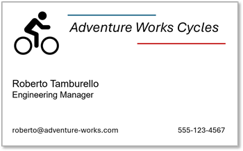
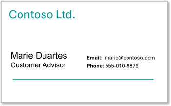

---
lab:
  title: Develop a Content Understanding client application
  description: Use the Azure Content Understanding Python SDK to create and use analyzers programmatically.
  duration: 30
  level: 300
  islab: true
  status: 'released'
  primarytopics:
    - Azure
    - Azure Content Understanding
---

# Develop a Content Understanding client application

In this exercise, you use the Azure Content Understanding Python SDK to create an analyzer that extracts information from business cards. You'll then develop a client application that uses the analyzer to extract contact details from scanned business cards.

This exercise takes approximately **30** minutes.

## Create a Microsoft Foundry resource and project

The features we're going to use in this exercise require a Microsoft Foundry resource and project.

1. In a web browser, open the [Microsoft Foundry portal](https://ai.azure.com) at `https://ai.azure.com` and sign in using your Azure credentials. Close any tips or quick start panes that are opened the first time you sign in.
1. Make sure the **New Foundry** toggle is on so that you're using **Foundry (new)**.
1. Select the project name in the upper-left corner, and then select **Create new project**.
1. Give your project a name and expand **Advanced options** to specify the following settings:
    - **Subscription**: *Your Azure subscription*
    - **Resource group**: *Create or select a resource group*
    - **Location**: Choose one of the following supported regions:\*
        - Australia East
        - East US
        - East US 2
        - Japan East
        - North Europe
        - South Central US
        - Southeast Asia
        - Sweden Central
        - UK South
        - West Europe
        - West US
        - West US 3

    > \*Azure Content Understanding is available in selected regions. See the [region support documentation](https://learn.microsoft.com/azure/ai-services/content-understanding/language-region-support) for the latest availability.

1. Select **Create** and wait for your project to be created. This will create a project and the parent resource.
1. Once created, select the project name at the top of the page, and select **Project details**. On that page, follow the link to the parent resource. Leave this browser tab open.

## Configure Content Understanding models and connection


Connect foundry thought CU portal

Content Understanding uses OpenAI models for analysis that are deployed in your project. You need to deploy these models before using analyzers, and set up the connection between Content Understanding and your Foundry resource. The easiest way is through the Content Understanding Studio.

1. In a new tab, navigate to [Content Understanding Studio](https://contentunderstanding.ai.azure.com/home) at `https://contentunderstanding.ai.azure.com/home` and sign in with your credentials.
1. Select the settings gear icon on the top navigation bar, and select **+ Add resource**.
1. Select your subscription and resource group where you created your Foundry resource, then select your Foundry resource name from the dropdown. This resource is the parent resource to the project you previously created.
1. Ensure the **Enable auto-deployment** box is checked, then select **Next** and **Save** to create the configuration.
1. Wait while it deploys the required models for Content Understanding.

## Prepare the development environment

You'll use Visual Studio Code as your development environment.

1. Start **Visual Studio Code**.
1. Open the Command Palette (press **Ctrl+Shift+P**), type **Git: Clone**, and select it.
1. In the URL bar, paste the following repository URL and press **Enter**:

    ```
    https://github.com/microsoftlearning/mslearn-ai-information-extraction
    ```

1. Choose a local folder to clone into, and then when prompted, select **Open** to open the cloned repository in VS Code.
1. In the VS Code Explorer pane, navigate to **Labfiles/02-content-understanding-api**. The folder contains two scanned business card images as well as the Python code files you need to build your app.
1. Open a new terminal and navigate to the app folder:

    ```
   cd Labfiles/02-content-understanding-api
    ```

1. Install the required libraries:

    ```
   python -m venv labenv
   labenv\Scripts\activate
   pip install -r requirements.txt azure-ai-contentunderstanding
    ```

1. In the VS Code Explorer pane, open the **.env** file in the **Labfiles/02-content-understanding-api** folder.
1. In the file, replace the **YOUR_ENDPOINT** and **YOUR_KEY** placeholders with your Microsoft Foundry resource endpoint and API key (copied from the portal tab you left open), and ensure that **ANALYZER_NAME** is set to `businesscardanalyzer`.

    > **Tip**: You can also find the endpoint and keys in the [Azure portal](https://portal.azure.com) by navigating to your Microsoft Foundry resource and viewing **Resource Management** > **Keys and Endpoint**.

1. Save the file (**CTRL+S**).

## Create an analyzer with the Python SDK

Now you'll use the Content Understanding Python SDK to create an analyzer that can extract information from images of business cards.

1. In the VS Code Explorer pane, open the **biz-card.json** file and review its contents. This JSON defines an analyzer schema for a business card, specifying the fields to extract (Company, Name, Title, Email, Phone).

1. Open the **create-analyzer.py** file in VS Code.

1. Review the code, which:
    - Imports the `ContentUnderstandingClient` and `AzureKeyCredential` from the [Azure Content Understanding SDK](https://learn.microsoft.com/python/api/overview/azure/ai-contentunderstanding-readme?view=azure-python-preview).
    - Loads the analyzer schema from the **biz-card.json** file.
    - Retrieves the endpoint, key, and analyzer name from the environment configuration file.
    - Calls a function named **create_analyzer**, which is currently not implemented.

1. In the **create_analyzer** function, find the comment **Create a Content Understanding analyzer** and add the following code (being careful to maintain the correct indentation):

    ```python
    # Create a Content Understanding analyzer
    print(f"Creating {analyzer}")

    # Create the Content Understanding client
    client = ContentUnderstandingClient(
        endpoint=endpoint,
        credential=AzureKeyCredential(key)
    )

    # Parse the schema JSON into a ContentAnalyzer object
    analyzer_definition = json.loads(schema)

    # Create the analyzer using the SDK (long-running operation)
    poller = client.begin_create_analyzer(
        analyzer_id=analyzer,
        resource=analyzer_definition,
        allow_replace=True
    )

    # Wait for the operation to complete
    result = poller.result()
    print(f"Analyzer '{analyzer}' created successfully.")
    print(f"Status: {result['status'] if isinstance(result, dict) else 'Succeeded'}")
    ```

1. Review the code you added, which:
    - Creates a `ContentUnderstandingClient` instance with the endpoint and API key.
    - Parses the analyzer schema JSON.
    - Uses `begin_create_analyzer` to start the long-running operation to create the analyzer.
    - Calls `.result()` to wait for the operation to complete.

    > **Note**: The SDK handles polling automatically through the `LROPoller` pattern — no manual polling is needed!

1. Save the file (**CTRL+S**).
1. In the VS Code terminal (make sure the virtual environment is still activated and you're in the **Labfiles/02-content-understanding-api** folder), run the Python code:

    ```
    python create-analyzer.py
    ```

1. Review the output from the program, which should indicate that the analyzer has been created.

## Analyze content using the Python SDK

Now that you've created an analyzer, you can consume it from a client application through the Content Understanding Python SDK.

1. In VS Code, open the **read-card.py** file.

1. Review the code, which:
    - Imports the `ContentUnderstandingClient` and `AzureKeyCredential` from the SDK.
    - Identifies the image file to be analyzed, with a default of **biz-card-1.png**.
    - Retrieves the endpoint and key from the environment configuration file.
    - Calls a function named **analyze_card**, which is currently not implemented.

1. In the **analyze_card** function, find the comment **Use Content Understanding to analyze the image** and add the following code (being careful to maintain the correct indentation):

    ```python
    # Use Content Understanding to analyze the image
    print(f"Analyzing {image_file}")

    # Create the Content Understanding client
    client = ContentUnderstandingClient(
        endpoint=endpoint,
        credential=AzureKeyCredential(key)
    )

    # Read the image data
    with open(image_file, "rb") as file:
        image_data = file.read()

    # Submit the image for analysis
    print("Submitting request...")
    poller = client.begin_analyze_binary(
        analyzer_id=analyzer,
        binary_input=image_data
    )

    # Wait for the analysis to complete
    result = poller.result()
    print("Analysis succeeded:\n")

    # Save JSON results to a file
    output_file = "results.json"
    with open(output_file, "w") as json_file:
        json.dump(dict(result), json_file, indent=4, default=str)
        print(f"Response saved in {output_file}\n")

    # Iterate through the contents and extract fields
    for content in result.contents:
        if hasattr(content, 'fields') and content.fields:
            for field_name, field_data in content.fields.items():
                value = field_data.value if hasattr(field_data, 'value') else None
                print(f"{field_name}: {value}")
    ```

1. Review the code you added, which:
    - Creates a `ContentUnderstandingClient` instance.
    - Reads the content of the image file as bytes.
    - Calls `begin_analyze_binary` to submit the image to the analyzer (the SDK handles the asynchronous polling automatically).
    - Calls `.result()` to wait for and retrieve the analysis results.
    - Saves the JSON response and parses the extracted fields.

1. Save the file (**CTRL+S**).
1. In the VS Code terminal, run the Python code:

    ```
    python read-card.py biz-card-1.png
    ```

1. Review the output from the program, which should show the values for the fields in the following business card:

    

1. Run the program again with a different business card:

    ```
    python read-card.py biz-card-2.png
    ```

1. Review the results, which should reflect the values in this business card:

    

1. To view the full JSON response that was returned, open the **results.json** file in VS Code, or run the following command in the terminal:

    ```
    cat results.json
    ```

## Clean up

If you've finished working with the Content Understanding service, you should delete the resources you have created in this exercise to avoid incurring unnecessary Azure costs.

1. In the [Azure portal](https://portal.azure.com), delete the resource group you created for this exercise.
