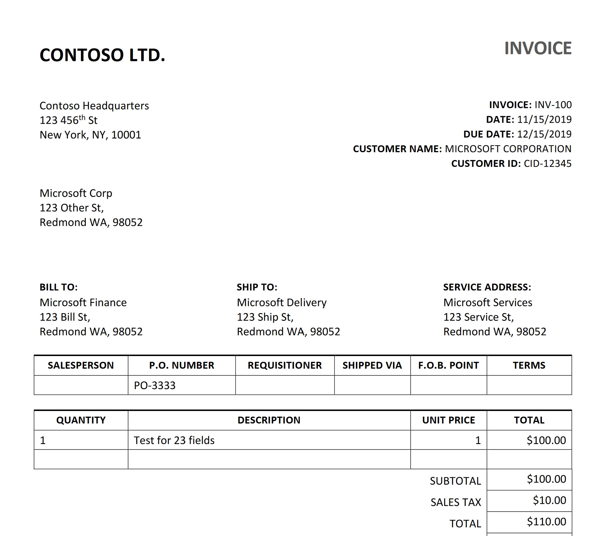
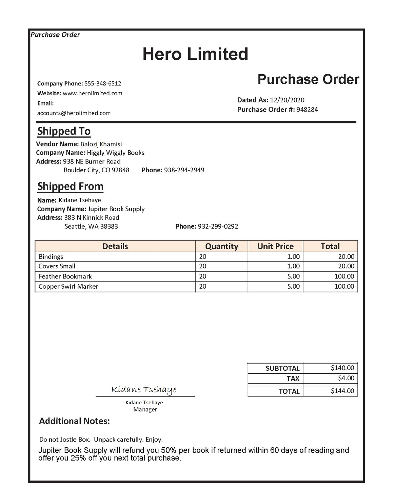

---
lab:
  title: Extract data with Azure Document Intelligence
  description: Use prebuilt and custom Document Intelligence models to extract structured data from documents.
  duration: 45
  level: 300
  islab: true
  status: 'released'
  primarytopics:
    - Azure
    - Azure Document Intelligence
---

# Extract data with Azure Document Intelligence

**Azure Document Intelligence** is an Azure AI service that enables you to build automated data processing software. This software can extract text, key/value pairs, and tables from form documents using optical character recognition (OCR). Azure Document Intelligence has pre-built models for recognizing invoices, receipts, business cards, and other common document types. The service also provides the capability to train custom models that can extract specific data fields from your own forms.

In this exercise you'll use both prebuilt and custom Document Intelligence models to extract information from documents.

This exercise takes approximately **45** minutes.

## Create a Document Intelligence resource

Azure Document Intelligence is included in Azure AI Services. You'll create a Document Intelligence resource directly from the Document Intelligence Studio.

1. In a web browser, navigate to the **Document Intelligence Studio** at `https://contentunderstanding.ai.azure.com/documentintelligence/studio` and sign in with your Azure credentials.
1. In the Studio, select the **Settings** icon (⚙) in the upper-right corner, and then select the **Resource** tab.
1. Select **Create a new resource** and configure it with the following settings:
    - **Subscription**: *Your Azure subscription*
    - **Resource group**: *Create or select a resource group*
    - **Name**: *A valid name for your Document Intelligence resource*
    - **Region**: *Any available region*
    - **Pricing tier**: Free F0 (*if you don't have a Free tier available, select Standard S0*)
1. Select **Create** and wait for the resource to be deployed. The Studio automatically connects to the new resource.

## Use the Read model in the portal

Now let's use the Read model in the Studio to analyze a multilingual document:

1. On the Document Intelligence Studio home page, under **Document analysis**, select the **Read** tile.
1. In the list of documents on the left, select **read-german.pdf**.
1. At the top toolbar, select **Analyze options**, then enable the **Language** check-box (under **Optional detection**) in the **Analyze options** pane and select **Save**.
1. At the top-left, select **Run Analysis**.
1. When the analysis is complete, the text extracted from the image is shown on the right in the **Content** tab. Review this text and compare it to the text in the original image for accuracy.
1. Select the **Result** tab. This tab displays the extracted JSON code.
1. Scroll to the bottom of the JSON code in the **Result** tab. Notice that the read model has detected the language of each span indicated by `locale`. Most spans are in German (language code `de`) but you can find other language codes in the spans (e.g., English — language code `en` — in one of the first spans).

## Analyze an invoice with a prebuilt model using the Python SDK

Now let's use the Document Intelligence Python SDK to analyze an invoice programmatically.

### Prepare the development environment

1. In the [Azure portal](https://portal.azure.com), find the Document Intelligence resource you created earlier. Under **Resource Management**, select **Keys and Endpoint**, and note the **Endpoint** and one of the **Keys**. You'll need these values shortly.
1. Start **Visual Studio Code**.
1. Open the Command Palette (press **Ctrl+Shift+P**), type **Git: Clone**, and select it.
1. In the URL bar, paste the following repository URL and press **Enter**:

    ```
    https://github.com/microsoftlearning/mslearn-ai-information-extraction
    ```

1. Choose a local folder to clone into, and then when prompted, select **Open** to open the cloned repository in VS Code.
1. Open a new terminal and navigate to the prebuilt Document Intelligence folder:

    ```
    cd Labfiles/03-document-intelligence/prebuilt/Python
    ```

1. Install the required libraries:

    ```
    python -m venv labenv
    labenv\Scripts\activate
    pip install -r requirements.txt
    ```

    > **Note**: The requirements.txt installs the [azure-ai-documentintelligence](https://learn.microsoft.com/python/api/overview/azure/ai-documentintelligence-readme?view=azure-python) Python SDK package and its dependencies.

1. In the VS Code Explorer pane, open the **.env** file in **Labfiles/03-document-intelligence/prebuilt/Python**.
1. In the file, replace the **YOUR_ENDPOINT** and **YOUR_KEY** placeholders with your Document Intelligence resource endpoint and API key.
1. Save the file (**CTRL+S**).

### Add code to analyze an invoice

This is the sample invoice that your code will analyze:



1. In VS Code, open the **document-analysis.py** file.

1. In the code file, find the comment **Import the required libraries** and add the following code:

    ```python
    # Add references
    from azure.core.credentials import AzureKeyCredential
    from azure.ai.documentintelligence import DocumentIntelligenceClient
    from azure.ai.documentintelligence.models import AnalyzeDocumentRequest
    ```

1. Find the comment **Create the client** and add the following code (being careful to maintain the correct indentation):

    ```python
    # Create the client
    document_analysis_client = DocumentIntelligenceClient(
        endpoint=endpoint, credential=AzureKeyCredential(key)
    )
    ```

1. Find the comment **Analyze the invoice** and add the following code:

    ```python
    # Analyze the invoice
    poller = document_analysis_client.begin_analyze_document(
        "prebuilt-invoice",
        AnalyzeDocumentRequest(url_source=fileUri),
        locale=fileLocale
    )
    ```

1. Find the comment **Display invoice information to the user** and add the following code:

    ```python
    # Display invoice information to the user
    result = poller.result()

    for document in result.documents:

        vendor_name = document.fields.get("VendorName")
        if vendor_name:
            print(f"\nVendor Name: {vendor_name.get('valueString')}, with confidence {vendor_name.get('confidence')}.")

        customer_name = document.fields.get("CustomerName")
        if customer_name:
            print(f"Customer Name: {customer_name.get('valueString')}, with confidence {customer_name.get('confidence')}.")

        invoice_total = document.fields.get("InvoiceTotal")
        if invoice_total:
            amount = invoice_total.get("valueCurrency", {})
            print(f"Invoice Total: {amount.get('currencySymbol', '$')}{amount.get('amount')}, with confidence {invoice_total.get('confidence')}.")
    ```

1. Review the code you added, which:
    - Creates a `DocumentIntelligenceClient` with your endpoint and credentials.
    - Uses the `prebuilt-invoice` model to analyze the document from a URL.
    - Iterates through the results and prints the vendor name, customer name, and invoice total.

1. Save the file (**CTRL+S**).
1. In the VS Code terminal, run the application:

    ```
    python document-analysis.py
    ```

1. Review the output. The program should display the vendor name, customer name, and invoice total with confidence levels. Compare the values with the sample invoice shown above.

## Train and test a custom model

The prebuilt models are useful for common document types, but often you need to extract specific data from your own forms. You can train a custom Document Intelligence model to extract the specific fields you need.

### Prepare training data

A setup script has been provided to create a storage account and upload sample forms for training.

1. In the VS Code terminal, navigate to the custom model folder:

    ```
    cd ../../custom
    ```

    > **Tip**: If you're unsure of your current directory, run `cd` to check.

1. In VS Code, open the **setup.sh** file in **Labfiles/03-document-intelligence/custom**.

1. Review the commands in the script. It will:
    - Create a storage account in your Azure resource group
    - Upload files from the *sample-forms* folder to a container
    - Print a Shared Access Signature (SAS) URI

1. Modify the **subscription_id**, **resource_group**, and **location** variable declarations with the appropriate values for the subscription, resource group, and location name where you deployed the Document Intelligence resource.

    > **Important**: For your **location** string, use the code format (e.g., `eastus` for "East US"). You can find this in the **JSON View** of your resource group in the Azure portal.

    If the **expiry_date** variable is in the past, update it to a future date, for example `2026-12-31`.

1. Save the file (**CTRL+S**).
1. To run the setup script, you need a Bash shell. You can use one of the following options, but be sure you're logged in to your Azure account:
    - **Azure Cloud Shell**: In the [Azure portal](https://portal.azure.com), open a Cloud Shell (Bash), navigate to the folder, and run `./setup.sh`.
    - **VS Code terminal (with WSL or Git Bash on Windows)**: Run `bash setup.sh`.

1. When the script completes, review the displayed output.
1. In the Azure portal, refresh your resource group and verify that the storage account was created. Open the storage account and in **Storage browser**, expand **Blob containers** and select the **sampleforms** container to confirm the files were uploaded.

### Train the model in Document Intelligence Studio

Now you'll use the training forms to build a custom extraction model.

1. Open a new browser tab and navigate to the **Document Intelligence Studio** at `https://documentintelligence.ai.azure.com/studio`.
1. Scroll down to the **Custom models** section and select the **Custom extraction model** tile.
1. If prompted, sign in with your Azure credentials.
1. If asked which Azure Document Intelligence resource to use, select the subscription and resource name you used when you created the resource.
1. Under **My Projects**, create a new project with the following configuration:

    - **Enter project details**:
        - **Project name**: *A valid name for your project*
    - **Configure service resource**:
        - **Subscription**: *Your Azure subscription*
        - **Resource group**: *The resource group of your Document Intelligence resource*
        - **Document Intelligence resource**: *Your Document Intelligence resource* (select the *Set as default* option and use the default API version)
    - **Connect training data source**:
        - **Subscription**: *Your Azure subscription*
        - **Resource group**: *Your resource group*
        - **Storage account**: *The storage account created by the setup script* (select the *Set as default* option, select the `sampleforms` blob container, and leave the folder path blank)

1. When your project is created, on the top right of the page, select **Train** to train your model. Use the following configuration:
    - **Model ID**: *A valid name for your model — note it down for later*
    - **Build Mode**: Template
1. Select **Go to Models**.
1. Training may take some time. Wait until the model status shows **succeeded**.

### Test the custom model with the Python SDK

1. In the VS Code terminal, navigate to the custom model Python folder:

    ```
    cd Python
    ```

1. Install the required packages (create a new virtual environment or reuse the existing one):

    ```
    python -m venv labenv
    labenv\Scripts\activate
    pip install -r requirements.txt
    ```

1. In VS Code, open the **.env** file in **Labfiles/03-document-intelligence/custom/Python**.

1. Update the file with the following values:
    - Your Document Intelligence **endpoint**
    - Your Document Intelligence **key**
    - The **Model ID** you specified when training your model
1. Save the file (**CTRL+S**).
1. In VS Code, open the **test-model.py** file.

1. Review the code, which uses the [azure-ai-documentintelligence](https://learn.microsoft.com/python/api/overview/azure/ai-documentintelligence-readme?view=azure-python) SDK. Notice that it references a test image hosted in the GitHub repo. The code creates a `DocumentIntelligenceClient`, submits the image for analysis using your custom model, and prints the extracted fields.
1. In the VS Code terminal, run the program:

    ```
    python test-model.py
    ```

1. Review the output. The program should display the field names and values extracted from the test form, such as `Merchant`, `CompanyPhoneNumber`, and other fields you defined during training.

    

## Clean up

If you've finished working with the Document Intelligence service, you should delete the resources you created in this exercise to avoid incurring unnecessary Azure costs.

1. In the [Azure portal](https://portal.azure.com), delete the resource group you created for this exercise.
